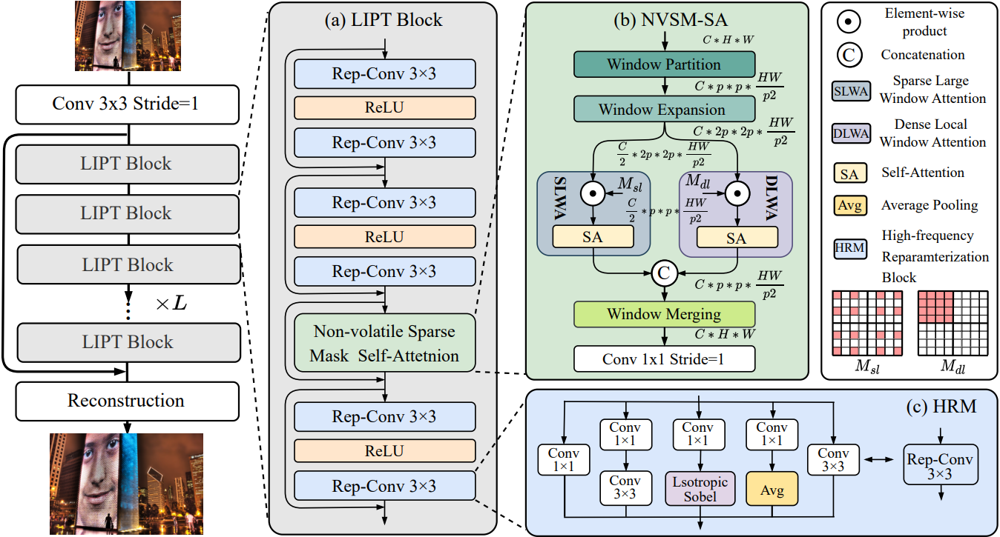
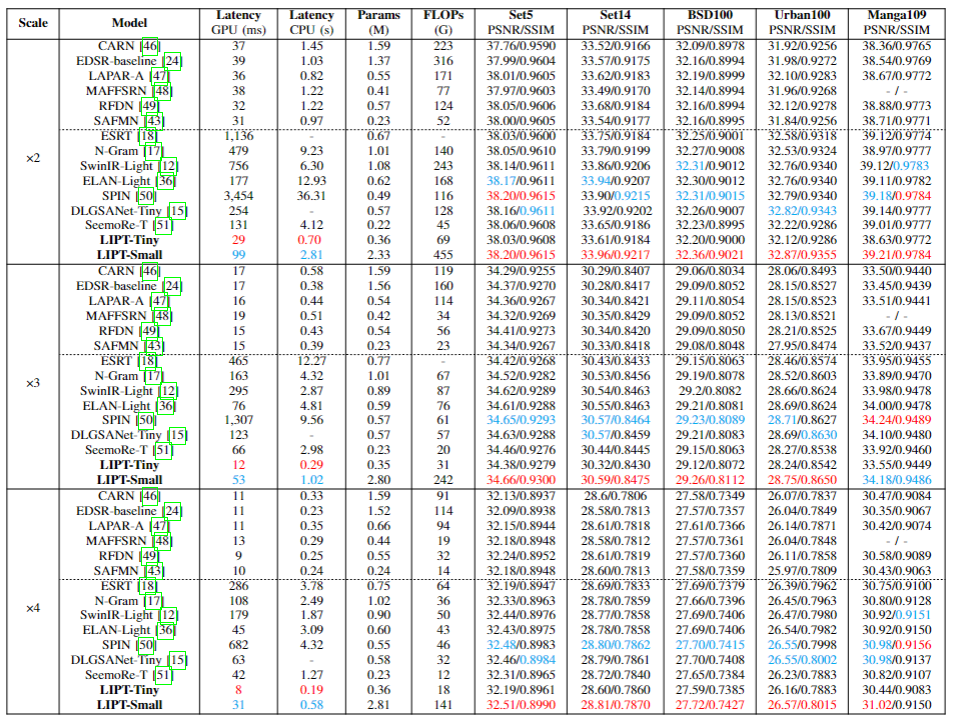
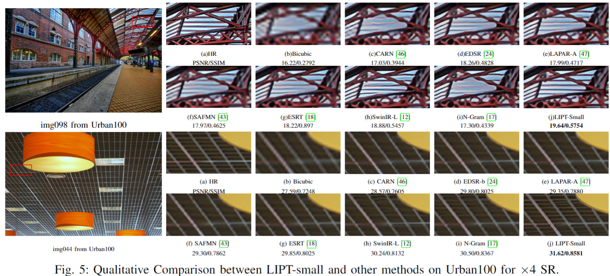

# LIPT: Latency-aware Image Processing Transformer

Codes for "LIPT: Latency-aware Image Processing Transformer"


  <a href="https://arxiv.org/abs/2404.06075">
    
   </a>

  <a href="https://ieeexplore.ieee.org/document/11008483/">
    
  </a>


> **LIPT: Latency-aware Image Processing Transformer** <br>
<div>
    Junbo Qiao<sup>1,†</sup>&emsp;
    Wei Li<sup>2†</sup>&emsp;
    Haizhen Xie<sup>2</sup>&emsp;
    Hanting Chen<sup>2</sup>&emsp;
    Jie Hu<sup>2</sup>&emsp;
    Shaohui Lin<sup>1,3*</sup>&emsp;
    Jungong Han<sup>4</sup>&emsp;
</div>

<div>
    <sup>1</sup>East China Normal University, <sup>2</sup>Huawei Noah’s Ark Lab, <br/>
    <sup>3</sup>Key Laboratory of Advanced Theory and Application in Statistics and Data Science- MOE, <br/>
    <sup>4</sup> University of Sheffield
</div>

---

> **Abstract:** 
Transformer is leading a trend in the field of image processing. While existing lightweight image processing transformers have achieved notable success, they primarily focus on reducing FLOPs (floating-point operations) or the number of parameters, rather than on practical inference acceleration. In this paper, we present a latency-aware image processing transformer, termed LIPT. We devise the low-latency proportion LIPT block that substitutes memory-intensive operators with the combination of self-attention and convolutions to achieve practical speedup. Specifically, we propose a novel non-volatile sparse masking self-attention (NVSM-SA) that utilizes a pre-computing sparse mask to capture contextual information from a larger window with no extra computation overload. Besides, a high-frequency reparameterization module (HRM) is proposed to make LIPT block reparameterization friendly, enhancing the model's ability to reconstruct fine details. Extensive experiments on multiple image processing tasks (e.g., image super-resolution (SR), JPEG artifact reduction, and image denoising) demonstrate the superiority of LIPT on both latency and PSNR. LIPT achieves real-time GPU inference with state-of-the-art performance on multiple image SR benchmarks.


## News
- [2025.04] 🚩Accepted by IEEE Transactions on Image Processing.
- [2025.02] Training codes is released.

## Dependencies & Installation
Please refer to the following simple steps for installation.
```
git clone https://github.com/Lucien66/LIPT.git
cd LIPT
conda env create -f environment.yml
conda activate LIPT
```

## Datasets


Used training and testing sets can be downloaded as follows:
| Task                                          |                         Training Set                         |                         Testing Set                          |                        Visual Results                        |
| :-------------------------------------------- | :----------------------------------------------------------: | :----------------------------------------------------------: | :----------------------------------------------------------: |
| image SR                                      | [DIV2K](https://data.vision.ee.ethz.ch/cvl/DIV2K/) (800 training images) +  [Flickr2K](https://cv.snu.ac.kr/research/EDSR/Flickr2K.tar) (2650 images) [complete dataset DF2K [download](https://drive.google.com/file/d/1TubDkirxl4qAWelfOnpwaSKoj3KLAIG4/view?usp=share_link)] | Set5 + Set14 + BSD100 + Urban100 + Manga109 [[download](https://drive.google.com/file/d/1n-7pmwjP0isZBK7w3tx2y8CTastlABx1/view?usp=sharing)] | [Google Drive](https://drive.google.com/drive/folders/12ecR677Hty1_WkbnKCOWaI1v4sNpVHsT?usp=share_link) |
| gaussian color image denoising                          | [DIV2K](https://data.vision.ee.ethz.ch/cvl/DIV2K/) (800 training images) +  [Flickr2K](https://cv.snu.ac.kr/research/EDSR/Flickr2K.tar) (2650 images) + [BSD500](http://www.eecs.berkeley.edu/Research/Projects/CS/vision/grouping/BSR/BSR_bsds500.tgz) (400 training&testing images) + [WED](http://ivc.uwaterloo.ca/database/WaterlooExploration/exploration_database_and_code.rar)(4744 images) [complete dataset DFWB_RGB [download](https://drive.google.com/file/d/1jPgG_URDQZ4kyXaMMXJ8AZ8jEErCdKuM/view?usp=share_link)] | CBSD68 + Kodak24 + McMaster + Urban100  [[download](https://drive.google.com/file/d/1baLpOjNlTCNbREUDAZf9Lso6YCeUOQER/view?usp=sharing)] | [Google Drive](https://drive.google.com/drive/folders/1H9nx0Gd6kfneh6anKaKzAgIn7G3djSSx?usp=share_link) |
| grayscale JPEG compression artifact reduction | [DIV2K](https://data.vision.ee.ethz.ch/cvl/DIV2K/) (800 training images) +  [Flickr2K](https://cv.snu.ac.kr/research/EDSR/Flickr2K.tar) (2650 images) + [BSD500](http://www.eecs.berkeley.edu/Research/Projects/CS/vision/grouping/BSR/BSR_bsds500.tgz) (400 training&testing images) + [WED](http://ivc.uwaterloo.ca/database/WaterlooExploration/exploration_database_and_code.rar)(4744 images) [complete dataset DFWB_CAR [download](https://drive.google.com/file/d/1IASyJRsX9CKBE0i5iSJMelIr_a6U5Qcd/view?usp=share_link)] | Classic5 + LIVE1 [[download](https://drive.google.com/file/d/1KJ1ArYxRubRAWP1VgONf6rly1DwiRnzZ/view?usp=sharing)] | [Google Drive](https://drive.google.com/drive/folders/1RA143yluYZAcWOzxeT7pE_olusEN99i4?usp=share_link) |


## Training
```
cd LIPT
python train.py --config [path to config]
```
For example,
```
python train.py --config ./config/lightx2.yml
```

## Convert the training-time models into inference-time

You may convert a trained model into the inference-time structure with
```
python convert.py [weights file of the training-time model to load] [path to save] --arch 'LIPT' --config [path to config]
```

## Test

Run the following script to test the converted model with deploy==True:

```
python test.py --config [path to config]
```

## Results

<details>
<summary>Quantitative Comparisons (click to expand)</summary>

<p align="center">
  
</p>
</details>

<details>
<summary>Visual Comparisons (click to expand)</summary>

<p align="center">
  
</p>
</details>


## Citation

If LIPT helps your research or work, please consider citing the following works:

----------
```BibTex
@inproceedings{qiao2024lipt,
  title={LIPT: Latency-aware Image Processing Transformer},
  author={Qiao, Junbo and Li, Wei and Xie, Haizhen and Chen, Hanting and Hu, Jie and Lin, Shaohui and Han, Jungong},
  booktitle={arXiv preprint arXiv:2404.06075},
  year={2024}
}
```

## Acknowledgement

This work is released under the Apache 2.0 license.
 The codes are based on [BasicSR](https://github.com/xinntao/BasicSR), [ELAN](https://github.com/xindongzhang/ELAN) and [DBB](https://github.com/xindongzhang/ELAN) Please also follow their licenses. Thanks for their awesome works.
